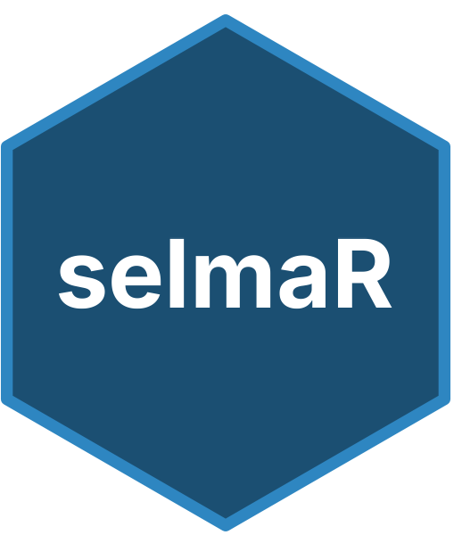
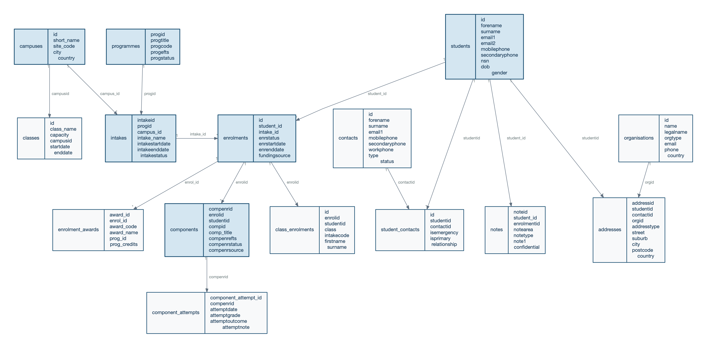

# selmaR 

<!-- badges: start -->
[](https://github.com/pcstrategyandopsco/selmaR)
[](https://CRAN.R-project.org/package=selmaR)
[](https://opensource.org/licenses/MIT)
<!-- badges: end -->

**Get your SELMA data into R in minutes.** Build student reports, track
enrolments, and generate EFTS funding breakdowns — all from clean,
analysis-ready tibbles.

selmaR is an R client for the [SELMA](https://selma.co.nz/) student management
system API, built for analysts at New Zealand PTEs and TEOs who want to turn
their student data into insights.

## Why selmaR?

- **Student reports in 5 lines of R** — connect, fetch, join, filter, done
- **EFTS funding breakdowns by month** — one function call, ready for TEC planning
- **Ask Claude about your enrolments in natural language** — via the built-in MCP server
- **30+ SELMA endpoints, zero pagination headaches** — Hydra JSON-LD handled for you

## Quick Start

```r
# Install from GitHub
# install.packages("pak")
pak::pak("pcstrategyandopsco/selmaR")
```

```r
library(selmaR)
library(dplyr)

# Connect once — all functions use it automatically
selma_connect()

# Fetch your data
students   <- selma_students()
enrolments <- selma_enrolments()
intakes    <- selma_intakes()
components <- selma_components()
```

That's it. Connect once and every function knows your session. Clean tibbles
with `snake_case` column names and character IDs ready for joining.

## What Can You Build?

### Active funded enrolments

```r
pipeline <- selma_student_pipeline(enrolments, students, intakes)

active_funded <- pipeline |>
  filter(enrstatus %in% SELMA_FUNDED_STATUSES)
```

### EFTS funding report

```r
report <- selma_efts_report(components, year = 2025)
```

Returns EFTS pro-rated across calendar months by funding source — ready for
dashboards or TEC planning.

### Ask Claude about your data

Point the selmaR MCP server at your SELMA instance and ask questions in plain
English:

> **You:** How many students are currently enrolled per programme?
>
> **Claude:** *fetches enrolments, joins to intakes and programmes, filters for
> funded statuses, and returns a summary table*

See [MCP Server](#mcp-server--ask-claude-about-your-data) below to set it up.

## MCP Server — Ask Claude About Your Data

The selmaR MCP server lets Claude read your SELMA data through the
[Model Context Protocol](https://modelcontextprotocol.io/). Ask questions in
plain English and get answers backed by live API data.

### Setup

Add the server to your Claude Code settings
(`~/.claude/settings.json` or project `.claude/settings.json`):

```json
{
  "mcpServers": {
    "selmaR": {
      "command": "Rscript",
      "args": ["/path/to/selmaR/inst/mcp/server.R"],
      "cwd": "/path/to/project/with/config.yml"
    }
  }
}
```

Then ask Claude anything about your student data — enrolment counts, programme
breakdowns, intake fill rates, EFTS summaries.

### PII protection

Student data is sensitive. The MCP server has **7 defence layers** including
input allowlisting, configurable field policies, output scanning, and
pseudonymised IDs. All data stays local — nothing is sent to external services
beyond the Claude API. See
[MCP Server Design & Security](articles/mcp-server-design.html) for the full
architecture.

## Explore the Guides

**Start here**

- **[Getting Started](articles/getting-started.html)** — Connect to SELMA, fetch your first dataset, and build a student pipeline — end to end in 10 minutes.

**Use cases**

- **[EFTS Pro-Rata Reporting](articles/efts-reporting.html)** — Generate monthly EFTS breakdowns by funding source for TEC planning and internal dashboards.
- **[Phone Number Normalisation](articles/phone-normalization.html)** — Standardise NZ and AU phone numbers so you can match SELMA students to external systems.

**MCP Server — ask Claude about your data**

> New to MCP? Start with **[MCP Examples](articles/mcp-examples.html)** — see
> what happens when you point Claude at your SELMA instance and ask questions
> in plain English. Then read
> **[MCP Server Design & Security](articles/mcp-server-design.html)** to
> understand the 7 defence layers that protect student PII.

**Reference**

- **[Limitations & Notes](articles/limitations.html)** — EFTS accuracy caveats, API rate limits, and known quirks worth knowing before you go to production.

## Configuration

Create a `config.yml` in your project root (**add it to `.gitignore`**):

```yaml
default:
  selma:
    base_url: "https://myorg.selma.co.nz/"
    email: "api@selma.co.nz"
    password: "your_password"
```

Also supports environment variables (`SELMA_BASE_URL`, `SELMA_EMAIL`,
`SELMA_PASSWORD`) and direct arguments. See `?selma_connect` for details.

## Entity Relationships



All IDs are character for safe joining across entities.

## License

MIT
